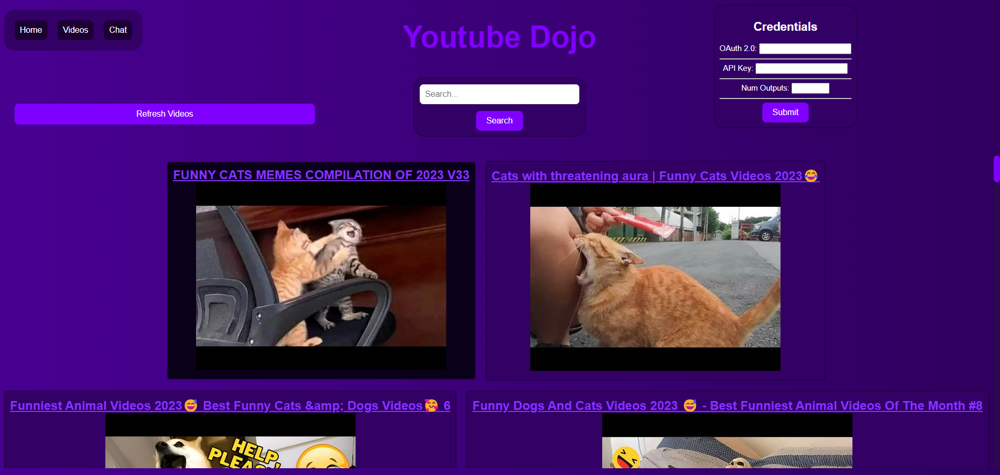

---

# YouTube Query Analyzer

The **YouTube Query Analyzer** is a powerful tool designed to analyze the performance of YouTube queries by retrieving information on video titles and thumbnails. This application leverages the YouTube Data API to fetch details such as titles, descriptions, and thumbnail URLs for videos matching a specified query. Developed using FastAPI and React, this project enables users to store and manage query parameters and API keys efficiently. The backend utilizes FastAPI to handle user and configuration data, while the frontend, built with React, provides a user-friendly interface for initiating YouTube searches and visualizing the results. Whether you're a content creator seeking insights into popular video titles or a marketer aiming to optimize query-based content, the YouTube Query Analyzer simplifies the process of gathering valuable information from the YouTube platform.

---

---

# Usage Instructions
1. This project uses docker files to simplify the usage of the app. For starters, make sure to install [Docker Desktop](https://www.docker.com/products/docker-desktop)
2. Once you have done that, fire up your ide of choice, or just use windows terminal(powershell is best)
3. In the same directory as the "docker-compose.yaml" file, type in "docker-compose up". It should assemble the app for you, then run it
4. If you want to make any changes to the app, then after you make the changes and save the file, run docker-compose up --build to rebuild the portions that have changed.

## Youtube Data API
+ This project utilizes the youtube data api, if you want to use this yourself, you will need to use use googles data api functionality
+ [Here is a video explaining how to set this up.](https://youtu.be/TE66McLMMEw?si=DENrWugxyO82521H)
+ Make sure to input the credentials inside of the JSON file inside of the app. **Do NOT share these credentials with anyone**

I had lots of fun designing this app, if you found this to be helpful, **make sure to give the repo a star**.

